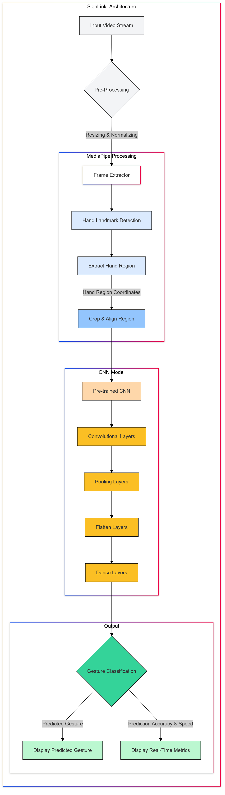

# SignLink: A Hybrid Approach to Real-Time Sign Language Recognition

## About the Project

**SignLink** is a real-time, efficient, and accessible solution for interpreting and learning sign language. By combining **MediaPipe** for rapid hand detection with a **Convolutional Neural Network (CNN)** for accurate gesture classification, SignLink achieves high accuracy without demanding heavy computational resources.

## Project Overview

Developed as part of our AIML specialization, **SignLink** addresses the challenge of sign language recognition across various devices. Initially, using only CNN provided excellent accuracy but required significant **processing power** and **GPU resources**, making it unsuitable for **mobile** or **low-resource devices**. MediaPipe alone, on the other hand, offered **high speed** but with **reduced accuracy**. The **hybrid approach** optimizes both **speed and accuracy**.

## Architecture and Implementation

### 1. MediaPipe for Hand Detection
- MediaPipe efficiently identifies hand landmarks, processing each frame in **30-40 ms**, which allows for rapid and accurate localization across devices.
- **Accuracy**: 83%
- **Speed**: 30-40 ms per frame

### 2. CNN for Gesture Classification
- The CNN model is pre-trained on a diverse dataset of gestures to recognize intricate hand patterns and classify gestures with high accuracy.
- **Accuracy**: 96%
- **Speed**: 300-500 ms per frame on CPUs (GPU required for real-time speed)

### 3. Hybrid Approach (MediaPipe + CNN)
- MediaPipe localizes and segments the hand region, which is then passed to the CNN for final classification. This hybrid approach significantly reduces computation time, achieving both efficiency and accuracy.
- **Accuracy**: 95%
- **Speed**: 80-100 ms per frame, compatible with a wide range of devices

## Performance Comparison

| Approach                 | Accuracy (up to) | Processing Time (ms/frame) | Device Compatibility            |
|--------------------------|------------------|----------------------------|---------------------------------|
| CNN Only                 | 99%              | 300-500                    | High-end devices, requires GPU  |
| MediaPipe Only           | 84%              | 30-40                      | All devices                     |
| Hybrid CNN + MediaPipe   | 97%              | 80-100                     | Broad compatibility             |

## Technical Workflow

### Workflow Steps
1. **Input Video Stream**: Raw video input from the webcam or an uploaded video file.
2. **Pre-Processing**: Resizing and normalizing frames to optimize model processing.
3. **MediaPipe Processing**: MediaPipe detects hand landmarks, and key points are extracted for the hand region.
4. **CNN Model**: The cropped hand region is processed through a CNN model with layers for feature extraction and gesture classification.
5. **Output**: Predicted gesture with accuracy and processing time, displayed to the user in real-time.

## Key Advantages

- **Reduced Latency**: Processing times of **80-100 ms per frame** allow for real-time feedback across devices.
- **Broader Compatibility**: Works effectively on both CPU and GPU, making it accessible for a wider user base.
- **Balanced Accuracy & Speed**: The combination of CNN’s high accuracy and MediaPipe’s efficiency provides an optimal solution for gesture recognition.

## Conclusion

SignLink demonstrates the potential of hybrid models in real-time applications, achieving an ideal balance between accuracy and speed for practical, real-world sign language interpretation.

---

## Contributors

- **Saksham Gupta**
- **Ayush Dixit**
- **Aryan Bhardwaj**
